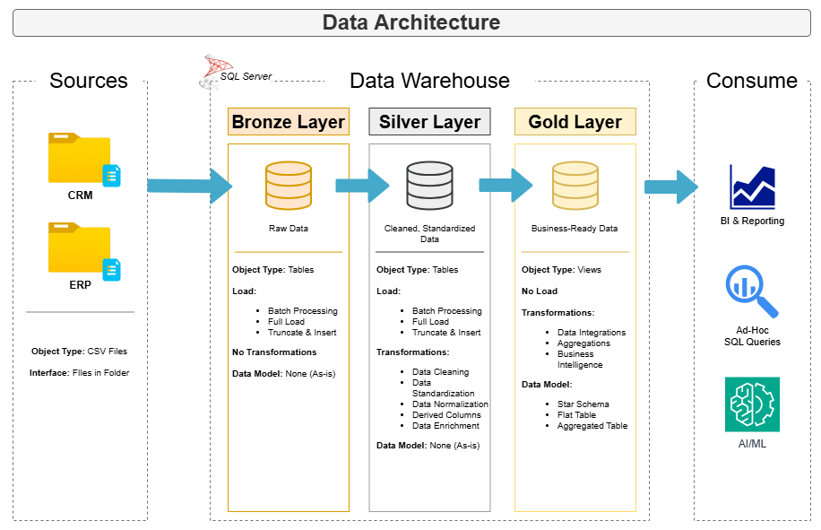

# Data Warehouse and Analytics Project

Welcome to the **Data Warehouse and Analytics Project** repository.
This project demonstrates a comprehensive data warehousing and analytics solution, from building a data warehouse to generating actionable insights. Designed as a portfolio project that highlights the best industry practices in data engineering.

---
## Data Architecture

The data architecture for this project follows Medallion Architecture **Bronze**, **Silver**, and **Gold** layers:

1. **Bronze Layer**: Stores raw data as-is from the source systems. Data is ingested from CSV files into a SQL Server Database.
2. **Silver Layer**: This layer includes data cleaning, standardization, and normalization to prepare data for analysis.
3. **Gold Layer**: Stores business-ready data, modeled into a star schema, required for reporting and analytics.

## Project Overview

This project involves:

1. **Data Architecture**: Designing a modern data warehouse using Medallion architecture **Bronze**, **Silver**, and **Gold** layers.
2. **ETL Pipelines**: Extracting, transforming, and loading data from source systems into the warehouse.
3. **Data Modeling**: Developing fact and dimension tables optimized for analytical queries.

## Project Requirements
Since this isn't a real-world project and exists solely for practice, I have included project requirements that would realistically arise in a real-world project.

### Building a Data Warehouse (Data Engineering)

### Objective
Develop a modern data warehouse using SQL Server to consolidate sales data, enabling analytical reporting and informed decision-making.

### Specifications
- **Data Sources**: Import data from two source systems (ERP and CRM) provided as CSV files.
- **Data Quality**: Clean and resolve data quality issues before analysis.
- **Integration**: Combine both sources into a single, user-friendly data model designed for analytical queries.
- **Scope**: Focus on the latest dataset only; historization of data is not required
- **Documentation**: Provide clear documentation of the data model to support both business stakeholders and analytics teams.

---

## Stay Connected with me!

Feel free to connect with me on LinkedIn:

---

Note: Project structure was inspired by Data with Baraa, with modifications, troubleshooting, and additional elements implemented independently.
